# IBM HR Attrition Analysis

**Tools:** R (base R, stats)  
**Dataset:** [IBM HR Analytics Employee Attrition](https://www.kaggle.com/datasets/pavansubhasht/ibm-hr-analytics-attrition-dataset) — 1,470 employees, 35 variables

---

## Overview

This project explores the IBM HR Analytics Employee Attrition dataset to uncover what drives employees to leave. The analysis moves from exploratory correlation through visualization to regression modeling — prioritizing analytical thinking over tool complexity.

---

## Questions Investigated

- Which numeric variables are most correlated with each other?
- Are employees who left statistically different from those who stayed?
- How well can Age and TotalWorkingYears predict MonthlyIncome?

---

## Analysis Workflow

### 1. Correlation Matrix
Reduced 35 variables to a focused set of numeric predictors and built a correlation matrix. Key finding: `MonthlyIncome` and `TotalWorkingYears` are strongly correlated.

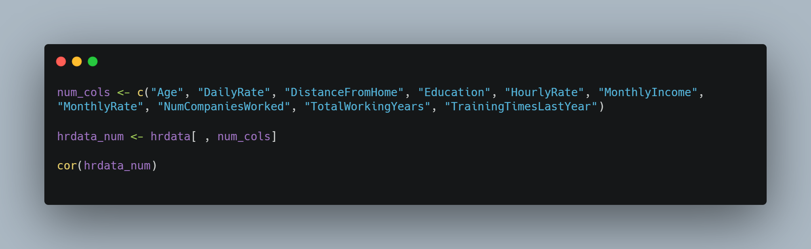

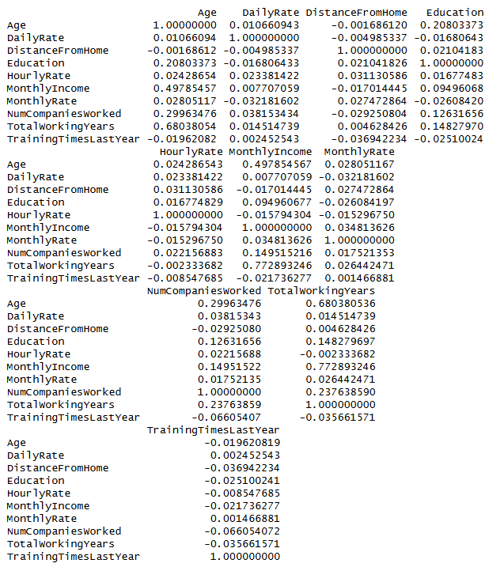

### 2. Scatterplot Matrix
Visualized relationships between `MonthlyIncome`, `Age`, and `TotalWorkingYears`. Income rises with both, but the relationship with experience is stronger.

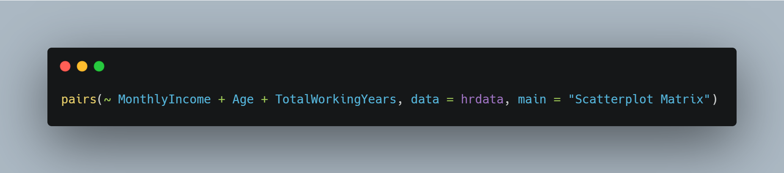

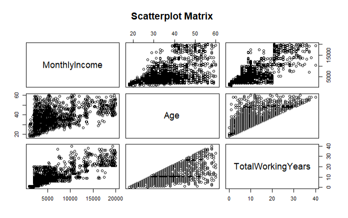

### 3. Attrition Signal Testing
Used boxplots and Welch two-sample t-tests to compare employees who left vs. stayed. Key finding: employees who left skewed significantly younger (p < 0.05). As a null control, the same test on `EmployeeNumber` returned no significant result.

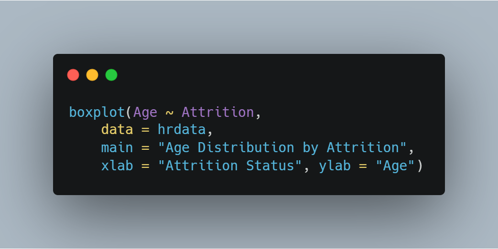

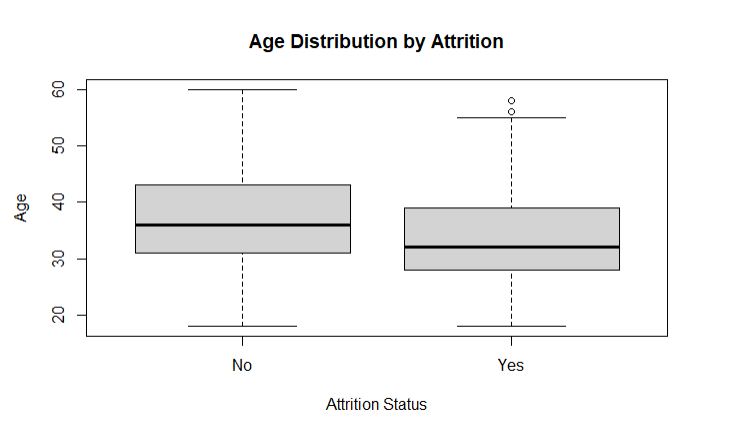

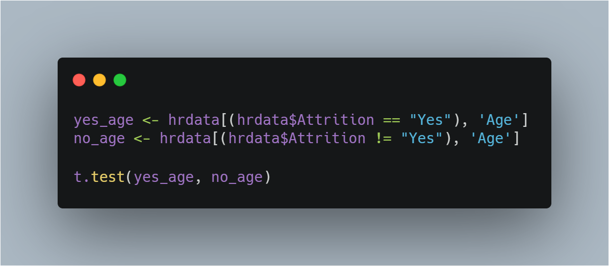

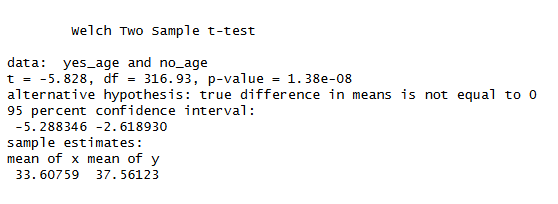

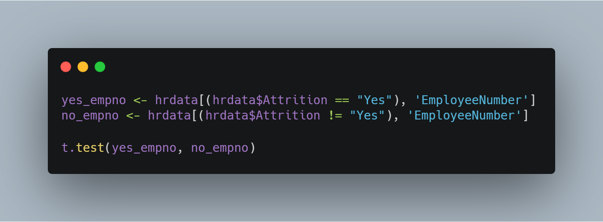

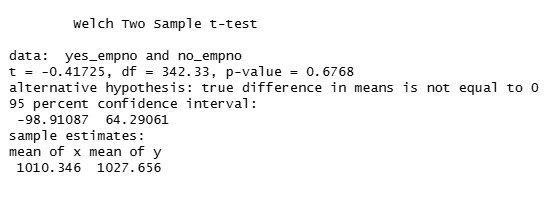

### 4. Regression Modeling
- **Model 1:** `MonthlyIncome ~ Age`

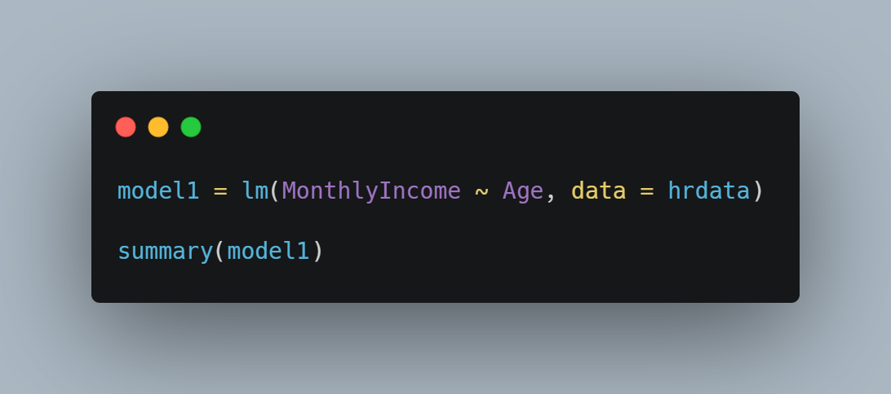

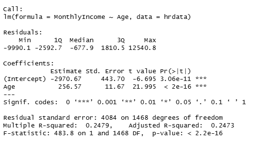

- **Model 2:** `MonthlyIncome ~ Age + TotalWorkingYears`

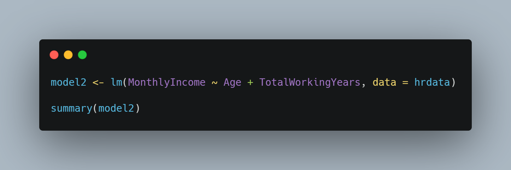

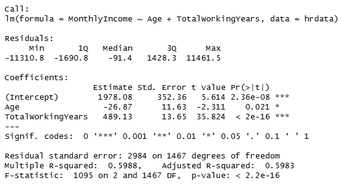

Adding `TotalWorkingYears` meaningfully increased explained variance, confirming that age and experience are related but not interchangeable.

---

## Key Takeaways

- Statistical significance needs a null control — testing `EmployeeNumber` made the Age finding trustworthy
- Visualization is a question, not an answer — every chart prompted the next test
- Regression is iterative — a one-variable model is a starting point, not a conclusion

---

## What's Next

A classification model to predict attrition directly — moving the analysis from descriptive to actionable.

---

## Connect

- [LinkedIn](https://www.linkedin.com/in/aristotle-polites)
- aristotle.polites@gmail.com
